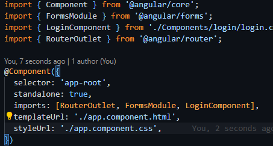

# Model Driven Forms

1. Import _FormsModule_ in _app.component.ts_.

    ```ts
    import { Component } from '@angular/core';
    import { FormsModule } from '@angular/forms';
    import { RouterOutlet } from '@angular/router';

    @Component({
      selector: 'app-root',
      standalone: true,
      imports: [RouterOutlet, FormsModule],
      templateUrl: './app.component.html',
      styleUrl: './app.component.css',
    })
    export class AppComponent {
      title = 'modelDrivenForms_Angular';
    }
    ```

2. We're gonna make a user authentication form, so we're going to save an email and a password. That's why we'll make a Model. Let's make a _Models_ folder inside of _/app_. And then a _UserDTO_ file inside. A Data Transfer Object is used to identify objects we're going to use to map entities coming from our backend.


3. Now, we'll make the auth component. For that, we want to create our new component inside _/app_. To do that, we are going to run `ng g c Components/login`.


4. We are also going to import the new component into _app.component.ts_.


5. Now, let's check that our login component works. To do that, let's go into _app.routes.ts_ and add our new component to the root of our app.


We will see the following "login works!" message when we visit our app in _localhost:4200_:

