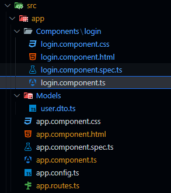

# Reactive Forms

1. The first thing we do is to create our new project using the Angular CLI while enabling the routing. We do this by running `ng new --routing reactiveForms_Angular`.
2. Then, we go to the app HTML file in _app.component.html_ and delete everything but the `<router-outlet/>` tag, so we don't have any of the preset information that Angular creates on the main page of our project.
3. Now, we need to import the _ReactiveFormsModule_ into our main module. So, inside of _app.component.ts_:

```ts
import { Component } from '@angular/core';
import { RouterOutlet } from '@angular/router';
import { ReactiveFormsModule } from '@angular/forms';   // We add this line

@Component({
  selector: 'app-root',
  standalone: true,
  imports: [RouterOutlet, ReactiveFormsModule],         // And include the new module to the imports
  templateUrl: './app.component.html',
  styleUrl: './app.component.css'
})
export class AppComponent {
  title = 'reactiveForms_Angular';
}
```

We're gonna make a user authentication form, so we're going to save an email and a password. That's why we'll make a Model. Let's make a _Models_ folder inside of _/app_. And then a _UserDTO_ file inside. A Data Transfer Object is used to identify objects we're going to use to map entities coming from our backend.

```ts
export class UserDTO {
    email: string;
    password: string;

    constructor(
        email: string,
        password: string,
    ){
        this.email = email;
        this.password = password;
    }
}
```
4. Now, we'll make the auth component. For that, we want to create our new component inside _/app_. To do that, we are going to run `ng g c Components/login`.


5. Now, let's check that our login component works. To do that, let's go into _app.routes.ts_ and add our new component to the root of our app.

```ts
import { Routes } from '@angular/router';
import { LoginComponent } from './Components/login/login.component';

export const routes: Routes = [
    {
        path:'',
        component: LoginComponent
    },
];
``` 

We will see the following "login works!" message when we visit our app in _localhost:4200_:


## Login Component implementation

1. So, first we need to import _FormBuilder, FormControll, FormGroup_ to our new component to build the form, and _UserDTO_ to save the information of the user.

```ts
// In login.component.ts

import { Component } from '@angular/core';
import { FormBuilder, FormControl, FormGroup, ReactiveFormsModule } from '@angular/forms';
import { UserDTO } from '../../Models/user.dto';

@Component({
  selector: 'app-login',
  standalone: true,
  imports: [ReactiveFormsModule],       // IMPORTANT
  templateUrl: './login.component.html',
  styleUrl: './login.component.css'
})
```

It's very important to import and include in the imports the _ReactiveFormsModule_ to be able to use reactive forms functionalities in our HTML later on.

2. Then, we declare and initialize the atributes of our component:

```ts
export class LoginComponent {
  user: UserDTO = new UserDTO('','');

  email: FormControl = new FormControl(this.user.email);
  password: FormControl = new FormControl(this.user.password);
  loginForm: FormGroup = new FormGroup({});

  constructor(private fb: FormBuilder) {
    this.loginForm = this.fb.group({
      email: this.email,
      password: this.password
    });
  }

  checkLogin(): void {
    this.user.email = this.email.value;
    this.user.password = this.password.value;

    console.log(
      'User: ',
      this.user.email,
      '\nPassword: ',
      this.user.password
    );
  }
}
```

First, we declare the _user_ attribute, which will hold the user information (email and password). Then we declare the two form inputs as FormControls to be able to access and validate both of them independently.

Finally, we declare the group of form controls (FormGroup) that will controll the whole form.Later, we need to initialize it using a form builder to create the form controller.

We've also implemented the method that processes the login information (_checkLogin()_).

3. Finally, we just need to bind the form controller to the actual form inside of the HTML:

```html
<!-- In login.component.html -->

<div class="container">
    <h1>Test Reactive Forms App</h1>
    <form [formGroup]="loginForm" (ngSubmit)="checkLogin()">
        <label for="email">
            Email: 
        </label>
        <input type="email" [formControl]="email">
    
        <label for="password">
            Password: 
        </label>
        <input type="password" [formControl]="password">
        
        <button type="submit" [disabled]="!loginForm.valid">Login</button>
    </form>
</div>
```

This way, we have our form done:


## Validation

1. To be able to validate our inputs we need to import the _Validators_ module into our component:

```ts
import { Component } from '@angular/core';
import {
  FormBuilder,
  FormControl,
  FormGroup,
  ReactiveFormsModule,
  Validators } from '@angular/forms';             // This line
import { UserDTO } from '../../Models/user.dto';
import { CommonModule } from '@angular/common';   // And this line
```

We also imported the _CommonModule_ to be able to use _ngIf_ and other Angular tools in our HTML file.

2. Then, we just have to add the validators to the _FormControls_ as follows:

```ts
// In login.component.ts

export class LoginComponent {
  user: UserDTO = new UserDTO('','');

  email: FormControl = new FormControl(this.user.email, Validators.required);   // Here
  password: FormControl = new FormControl(this.user.password, Validators.required);   // And here
  loginForm: FormGroup = new FormGroup({});

  // Other things
}
```

_Validators.required_ just validates that the input has a value inside of it. There are a ton more that come prebuilt in Angular. For example, _Validators.minLength(N)_ checks that the length of the input is, at least, of N characters.

3. Now, we need to add some feedback so the user knows when and why the validation fails.

```html
<!-- In login.component.html -->

<div class="container">
    <h1>Test Reactive Forms App</h1>
    <form [formGroup]="loginForm" (ngSubmit)="checkLogin()">
        <label for="email">
            Email: 
        </label>
        <input type="email" [formControl]="email">
        <div class="errors" *ngIf="email.errors && email.dirty">
            <span>
                Email is required
            </span>
        </div>    <!-- This div -->

        <label for="password">
            Password: 
        </label>
        <input type="password" [formControl]="password">
        <div class="errors" *ngIf="password.errors && password.dirty">
            <span>
                Password is required
            </span>
        </div>    <!-- And this div -->

        <button type="submit" [disabled]="!loginForm.valid">Login</button>
    </form>
</div>
```

The error divs only show the error when there are errors in the validation of the input (remember that the only validation by now is that the input needs to be filled) and the input has been edited, so the errors don't show before the user edits the form.

The inputs have been filled, so the button is enabled:


The inputs' content has been deleted by the user, so the button is disabled and the errors are showed to the user:

